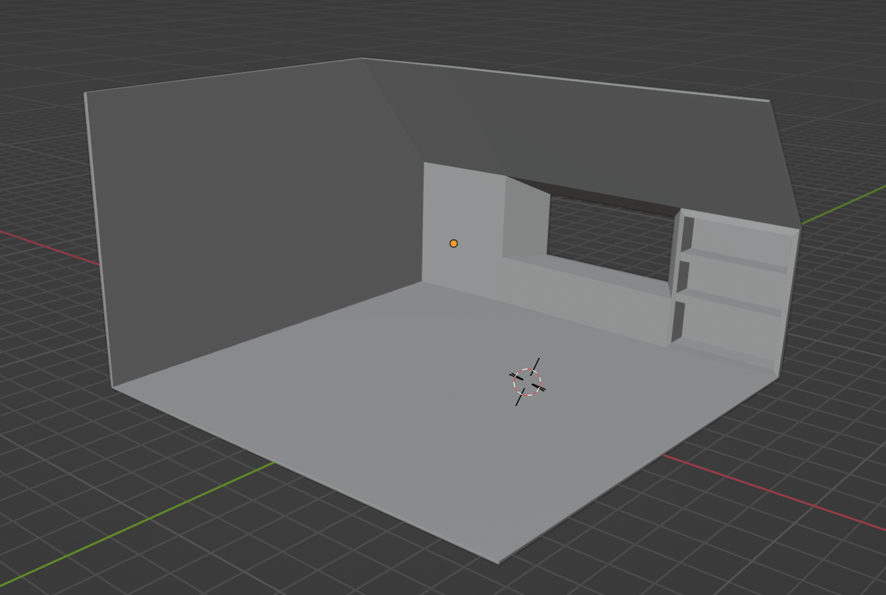
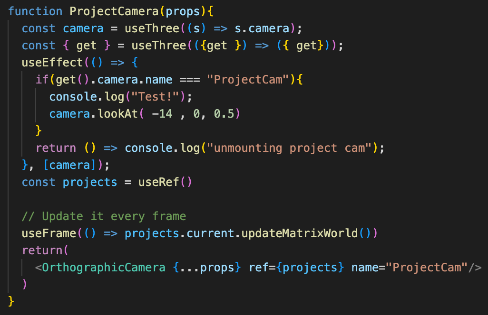
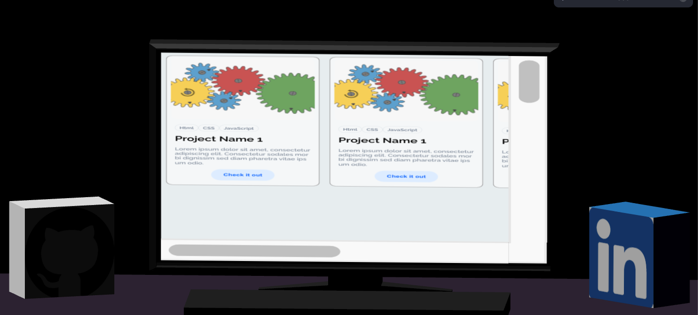
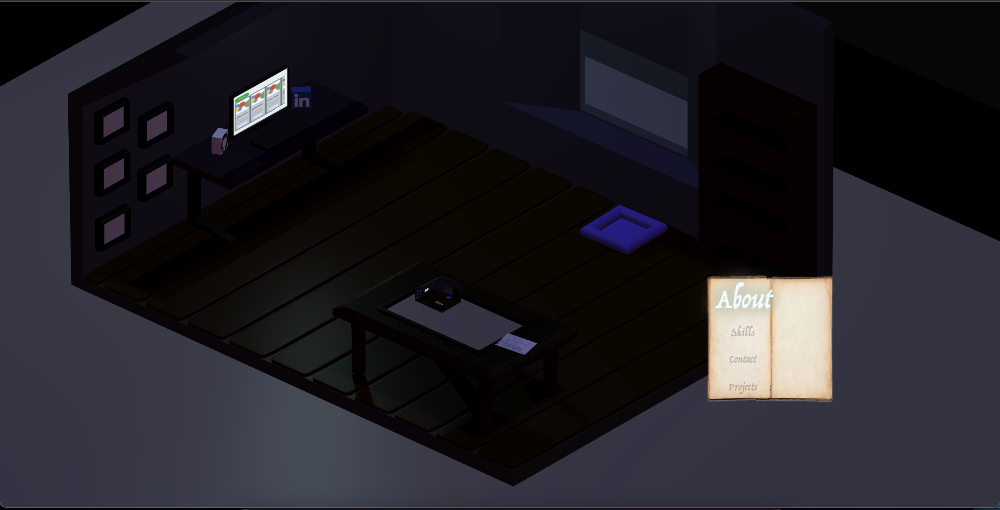

## Portfolio
Repository for my portfolio build and tests.

### The Stack
#### Html
- Hypertext markup language. This is what is used to translate everything you see and interact with on the web. [Wiki](https://en.wikipedia.org/wiki/HTML)
#### CSS
- Cascading style sheets. This is used to alter Html and change what your webpage looks like. [Wiki](https://en.wikipedia.org/wiki/CSS)
#### JavaScript
- This is the behavior of your webpage. [JavaScript]https://www.javascript.com/
#### React
- A javascript library that is used for buulding user interfaces. React uses JSX (which is like JavaScript combined with HTML) [React](https://reactjs.org/)
#### React-Three/Fiber
- React-Three-Fiber is a library that allows three.js to be used in react. Three.js is a library the is built on webGL to enable 3d rendering inside of html elements. [React-Three/Fiber](https://docs.pmnd.rs/react-three-fiber/getting-started/introduction)
#### React-Three/Drei
- React-Three/Drei is a helper that allows for easier manipulation of React-Three-Fiber [React-Three/Drei](https://github.com/pmndrs/drei)
#### Leva
- Leva is a helper that is designed to allow the user visual manipulation in a rendered scene. [Leva](https://github.com/pmndrs/leva)
#### Three.js
- A JavaScript library that uses webGL to render 3d objects and animations. (My original inspiration to make a 3d website portfolio.)[Three.js](https://threejs.org/)

## Going Forward 6/5/2022
- So I have been working with React-Three-Fiber for a couple weeks now and it is tough to really grasp. I think I have been trying to impliment too many features and ideas instead of working on an MVP. I will document the entire process here and try to stick to my goals and what is actually required and then polish once those goals have been met.
- Some of the things I was able to accomplish were: Importing custom models, and using them in the scene. Importing custom node modules for easier control of the project (drei, Transform).
- Great tools to use: [Controls](https://codesandbox.io/s/transformcontrols-and-makedefault-btsbj), [Possible way for UI](https://codesandbox.io/s/html-annotations-zu2wo),

## MVP
- First is setting up a scene.
- Have objects populate the scene to represent a room with target locations.
- Have a camera with fixed perspective.
- Display an interactive UI.
- With interaction with the UI transform the camera to target locations. (clicking a button to move to a new page)
- Have a back to the start location once at the target. (clicking a button to return to the home page)
- Have UI elements displayed at each target location representing: [Have HTML in R3F](https://codesandbox.io/s/html-markers-6oei7)
  - About ME
     Who I am, hobbies, what kind of work I do/like (this will be represented by all of the objects filling the scene) Photos, 3d representations, etc.
  - Skills
    Tech Stack showcasing what I have learned.
  - Projects
    Display actual projects or links to projects.
  - Contact Form
    A way to reach me

## Stretch Goals
- Either create (with blender) or import actual objects to fill the scene.
- Great light sources with soft shadows [Soft Shadows](https://codesandbox.io/s/soft-shadows-dh2jc)
- Have dynamic, interactable objects. Rolling a d20, fading opacity on the Nav Menu, animating a book to open. [Animation](https://codesandbox.io/s/floating-laptop-q23sw) example 
  [Physics](https://codesandbox.io/s/simple-physics-demo-with-debug-bounds-0k27n) example
- Display 'Skills' using words overlaying on an invisible [sphere](https://codesandbox.io/s/spherical-word-cloud-yup2o)
- Have the scene be a mandala (scene in a scene in a scene) for artistic purposes.
- Create a loading page with meaning
- Particle effects inside the Nav Menu (a spellbook)
- Switch from fixed perspective to free camera control. Have the spellbook/ui linked to the orbitControl camera.

## Create the Canvas
 - [x] - Canvas created: Accomplished on 6/7/2022
 - [x] - import tools to control objects and find coordinates. - Accomplished on 6/16/2022 (Found LEVA helper!) [leva](https://github.com/pmndrs/leva)
 - [x] - STRETCH - able to change the size of Canvas. (Put it in a div, scale/place where needed) Accomplished on 6/7/2022. Canvas is controlled by its direct parent. Make a div with a className and then I can scale it in styles.css

## Objects populate scene
 - [x] - Have objects in the scene in a thoughtful layout. 6/21/2022 Created a very barebones skeleton!
 - [x] - Replace objects with what they should represent (table, desk, bookshelf, book, etc) 6/21/2022 Created a very barebones skeleton!
 - [x] - STRETCH - polish the looks of each object/replace with imported objects. 6/21/2022 Created a very barebones skeleton - I custom made all models in blender

## Camera
 - [x] - Fixed position - Accomplished on 6/8/2022
 - [x] - Link camera to an event listener (clicking a button) 6/21/2022 This took longer than expected.
 - [x] - Change position of camera to new position after click. 6/21/2022 - Have multiple cameras, each position is changed to on click.
 - [ ] - STRETCH - Camera is limited but free use. Change position based on click (current position to new position, rotation etc Camera is animated? )

## UI
 - [x] - Have HTML elements display at fixed locations (About me, skills, projects, contact) Accomplished on 6/7/2022. Created a component that can be passed into other objects (like a box). Then inside the box I can add specific HTML. (Thanks drei)
 - [x] - Event listener on navigation HTML element 6/21/2022
 - [x] - Link navigation component to camera component 6/21/2022
 - [x] - Style the HTML elements to be visually appealing 6/21/2022 - It works for now, very basic.
 - [ ] - STRETCH - create 'magic' effects and polish UI elements further.
 - [ ] - STRETCH - create a loading screen.

 ## The Stack
 - React, @React-Three/Fiber, @React-Three/Drei, Leva, Html, Css.

 - STRETCH - I want to make this project a full stack application in the future. I have been reading into NEXT.js framework and it can use React. This means I should be able to make this a NEXT.js with React-Three-Fiber.

 ## 6/7/2022
  - Set up a canvas that can be resized. The canvas is directly rendered through its parent. Having a div with a class name allows me to set the size to whatever I would like in css or inline.
  - Set up Html component. By using the Html helper from drei I was able to create a component that allows Html to be passed into it. This component can be attached to 3d objects being rendered inside of the Canvas. By attaching the Html components this way, the location is automatically updated with the location of the object. (So if you rotate around the object the Html Component will also rotate with the object.)

## 6/8/2022
  - Set up fixed position camera in orbit controls. The rotation is locked with a min/max by using Azimuth angle, and Polar angle. Can also limit min-zoom and max-zoom. Looking ahead I think I will have to make a function with an eventlistener on click to set the perspective where I need it to be. This could be a limitation, and a workaround would be to have 'clickable' objects that then display each specific html element i want when clicked.
  - Had a wierd GIT error where I was commiting as LEARN Academy- Laptop.

  ## 6/16/2022
  - I have run into some blockers regarding how to implement my camera changing positions. I might have a few ways to do it, but still need practice with R3F to really grasp it.
  - I have implemented a way to control objects in the canvas to find positions, scale, rotation, and color( I know there is more to Leva but that is what I have accomplished so far).
  
  
  - Leva will allow me to quickly navigate and organize each component on the scene. Since my project is a 3d 'world', knowing the placement and being able to move things exactly where I need them is crucial - this will save tons of time. (no more editing components by 1 value and waiting to see what changed!) 
  
  - I have also created the UI for my project section as a placeholder. I have cards that display an image, have tags to display what language, the title of the project, and a basic button. I did not create the styling for this, just implemented it into the scene to fit what I needed.
  
  
  - I have implemented a possible NavBar that looks like a spellbook.
  
  - The Spellbook would be transparent when not using it (fades out by 50%), but when you hover over it, the transparency goes to 100%. The buttons also expand towards you like they are coming off the page.
  

  ## Huge Updates from June 16 - June 21
  - Started to create object in Blender. It wasn't too hard but takes a long time.
  
  - Finally got the camera switching working. I have to make each camera update it's look position on initialization. I did this through a useEffect()  {get} to find each specific camera and make it look at a specified point. 
  
  - I was able to position Html components successfully:
  
  - Got the website deployed. (don't honestly know what I changed to make it happen) Has something to do with paths. (I still get error 404 when trying to load the Room2.glb on initialization but I can ignore that for now.)
  
  - Started adding lights. Just need some basic lights to render into the scene.
  - Still need a Contact camera/method set up for people to get in touch.
  - Still want to implement some easter eggs and cool user experiences.
